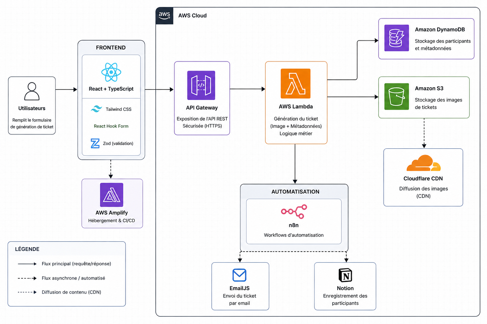
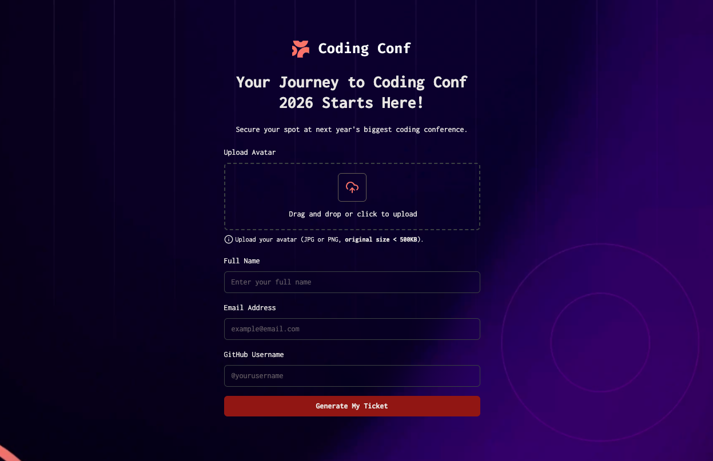

# ☁️ Ticket Generator — DevOps & Cloud AWS

### Architecture serverless · CI/CD · Automatisation · Observabilité · Sécurité

---

## 🏗️ Architecture Cloud

---

## 🎯 Objectif du projet

Ce projet a été conçu avant tout pour mettre en pratique des compétences **DevOps et Cloud AWS** autour d’une application réelle.

L’objectif principal était de construire une chaîne complète allant du code jusqu’à la production :

- déploiement automatisé
- architecture serverless
- gestion de services AWS managés
- persistance des données
- automatisation des workflows
- distribution de contenu
- supervision de l’application
- sécurisation des accès
- intégration continue

L’application React sert ici de **workload** pour tester et exploiter cette architecture cloud.

---

# 🚀 Compétences DevOps mises en pratique

## ☁️ Cloud AWS

Services utilisés :

- **AWS Lambda** — exécution serverless de la logique métier
- **Amazon API Gateway** — exposition de l’API REST
- **Amazon DynamoDB** — stockage NoSQL des participants
- **Amazon S3** — stockage objet des tickets générés
- **AWS Amplify** — hébergement du frontend et déploiement continu

Architecture pensée pour limiter la gestion d’infrastructure traditionnelle et exploiter des services managés AWS.

---

## 🔁 STACKS

# 🧱 Stack DevOps / Cloud

| Domaine              | Technologies         |
| -------------------- | -------------------- |
| Cloud                | AWS                  |
| Compute              | AWS Lambda           |
| API Management       | Amazon API Gateway   |
| Database             | Amazon DynamoDB      |
| Object Storage       | Amazon S3            |
| Hosting              | AWS Amplify          |
| CI/CD                | AWS Amplify + GitHub |
| Automation           | n8n                  |
| CDN                  | Cloudflare           |
| Monitoring           | Amazon CloudWatch    |
| Version Control      | Git / GitHub         |
| Frontend workload    | React.js             |
| Language             | TypeScript           |
| Styling              | TailwindCSS          |
| Validation           | Zod                  |
| Form Management      | React Hook Form      |
| Email                | EmailJS              |
| External Integration | Notion API           |

## 🏗️ Application

## 🎯 Objectif

Créer une expérience d'inscription fluide et automatisée permettant aux participants de :

- Remplir un **formulaire d'inscription sécurisé** avec validation en temps réel.
- Recevoir instantanément un **ticket personnalisé** par email.
- Être automatiquement **enregistrés dans la base de données** de l'événement.

> 🧠 *Une architecture serverless pensée pour la **scalabilité** et l'**automatisation**.*

