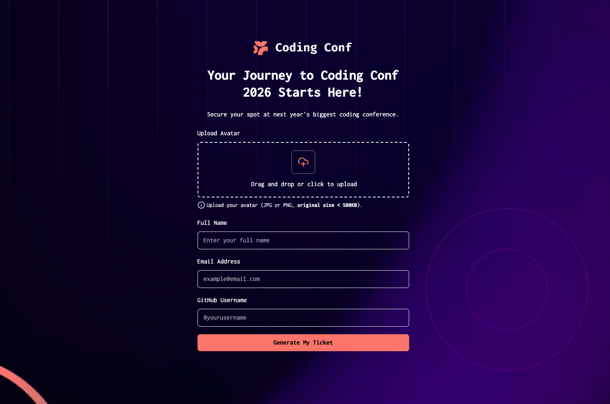

<div align="center">


# 🎫 TICKET GENERATOR - CODING CONF 2025  
### **Générez votre ticket. Rejoignez la conférence.**

---

Application serverless complète pour la génération automatisée de tickets personnalisés :  
✅ Génération de tickets personnalisés  
✅ Validation & gestion de formulaire  
✅ Envoi automatique par email  
✅ Architecture serverless évolutive  
✅ Déploiement automatique via AWS Amplify

</div>

---

### 🏗️ Architecture (diagramme)


## 🎯 Objectif

Créer une expérience d'inscription fluide et automatisée permettant aux participants de :
- Remplir un **formulaire d'inscription sécurisé** avec validation en temps réel.
- Recevoir instantanément un **ticket personnalisé** par email.
- Être automatiquement **enregistrés dans la base de données** de l'événement.

> 🧠 *Une architecture serverless pensée pour la **scalabilité** et l'**automatisation**.*

---

## ✨ Fonctionnalités clés (orientées utilisateur)

### 📝 Formulaire intelligent
- Validation en temps réel avec **Zod**
- Gestion optimisée via **React Hook Form**
- Upload d'avatar avec prévisualisation
- Feedback utilisateur immédiat

### 🎨 Génération de tickets
- Tickets personnalisés avec les données du participant
- Design responsive et moderne
- Stockage sécurisé sur **Amazon S3**
- Génération côté serveur pour des performances optimales

### 📧 Automatisation complète
- Envoi automatique du ticket par **EmailJS**
- Enregistrement dans **Notion** via **n8n**
- Stockage des données dans **DynamoDB**
- Workflow entièrement automatisé

### ♿ Accessibilité & UX
- Interface intuitive et claire
- Messages d'erreur explicites
- États de chargement visibles
- Navigation fluide

---

## 🚀 Stack & architecture

| Technologie      | Usage |
|------------------|--------|
| **React.js** | Front-end + UI Components |
| **TypeScript**        | Typage statique |
| **Zod**    | Validation de schéma |
| **React Hook Form** | Gestion de formulaire |
| **TailwindCSS**       | Styling responsive |
| **AWS Lambda** | Fonctions serverless |
| **AWS API Gateway** | Exposition de l'API REST |
| **AWS DynamoDB** | Base de données NoSQL |
| **AWS S3** | Stockage des images |
| **AWS Amplify** | Hébergement + CI/CD |
| **n8n** | Automatisation des workflows |
| **EmailJS** | Envoi d'emails |
| **Notion API** | Gestion des participants |
| **Cloudflare** | CDN + Optimisation images |
| **GitHub Actions** | CI/CD automatisé |

---

## 🔄 Flux de données

1. **Inscription** : L'utilisateur remplit le formulaire
2. **Validation** : Zod + React Hook Form vérifient les données
3. **API Call** : Envoi vers AWS API Gateway
4. **Lambda Processing** : Génération du ticket + upload S3
5. **DynamoDB** : Stockage des informations participant
6. **n8n Trigger** : Déclenchement du workflow d'automatisation
7. **Email** : Envoi du ticket via EmailJS
8. **Notion** : Ajout du participant dans la base

---

## 🌐 Déploiement & Performance

- **Hébergement** : AWS Amplify avec build automatisé depuis GitHub
- **CDN** : Cloudflare pour l'optimisation globale des images
- **Serverless** : Architecture scalable automatiquement selon la charge
- **CI/CD** : Déploiement automatique à chaque push sur `main`

---

## 📊 Avantages de l'architecture serverless

✅ **Scalabilité automatique** : Gère automatiquement les pics de trafic  
✅ **Coûts optimisés** : Pay-per-use, pas de serveur idle  
✅ **Haute disponibilité** : Infrastructure distribuée AWS  
✅ **Maintenance réduite** : Pas de gestion de serveur  
✅ **Sécurité** : IAM roles et permissions granulaires

---

## 🛠️ Installation & Déploiement

### Prérequis
```bash
Node.js >= 18
AWS CLI configuré
Compte AWS Amplify
```

### Installation locale
```bash
# Cloner le repository
git clone https://github.com/votre-username/ticket-generator.git

# Installer les dépendances
npm install

# Lancer en développement
npm run dev
```

---

## 📝 License

MIT License - voir le fichier [LICENSE](LICENSE) pour plus de détails.

---

 